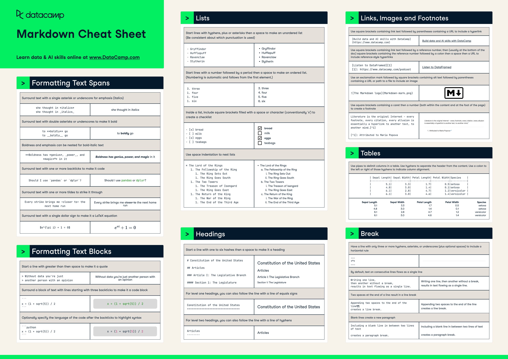

## Markdown Cheat Sheet:
A Markdown file is a plain text file that uses Markdown formatting syntax to specify how text should be structured and styled. Markdown is a lightweight markup language with a simple syntax that is often used for creating formatted documents, particularly for web content, README files in software projects, documentation, and notes. Markdown files typically have the extension **.md** and they can be edited using any text editor. 

Here are some of the most commonly used methods for manipulating text in markdown: 


Code Highlighting:  

We can highlight `code` snippets using the three `backticks` (```):

```
Markdown Highlighting
```


Heading:

```
# Heading 1
## Heading 2
### Heading 3
```

# Heading 1
## Heading 2
### Heading 3


Bold:

```
**bold text** </br>
__bold text__
```

**bold text** </br>
__bold text__


Italic: 

```
*italicized text* </br>
_italicized text_
```

*italicized text* </br>
_italicized text_


Strikethrough:

```
~~Strike through~~
```

~~Strike through~~


Text colors:

```
Color of <span style="color:red">Markdown</span> text.
```

Color of <span style="color:red">Markdown</span> text. 


Ordered List:

```
1. First item
2. Second item
3. Third item
```

1. First item
2. Second item
3. Third item


Unordered List:

```
- First item
- Second item
- Third item
```

- First item
- Second item
- Third item


Task List:

- [x] Write the press release
- [ ] Update the website
- [ ] Contact the media


Buttons:

```
<kbd>Ctrl + shift + p</kbd>
```

<kbd>Ctrl + shift + p</kbd>


Comments:

```
<!--
This is a comments:
-->
```

<!--
This is a comments:
-->


Table:

```
| Col1         |      Col2     |  Col3           |
|--------------|---------------|---------------- |
| Row-1        | 2.426.1       | 2.419           |
| Row-1        | 2.361.1       | 2.357           |
| Row-1        | 2.346.1       | 2.340           |
```

| Col1         |      Col2     |  Col3           |
|--------------|---------------|---------------- |
| Row-1        | 2.426.1       | 2.419           |
| Row-1        | 2.361.1       | 2.357           |
| Row-1        | 2.346.1       | 2.340           |


Horizontal Rule:

```
Three or more dashes (---) or asterisks (***): 
---
***
---
```


Three or more dashes (---) or asterisks (***): 
---
***
---


Link:

```
[Title_name](https://www.example.com)
```

[Title_name](https://www.google.com)


Alignments:

```
<p align="center">

</p>
```

<p align="center">

</p>


Image:

```

```


Alerts:
```
> [!NOTE]
> Essential details that users should not overlook, even when browsing quickly.

> [!TIP]
> Additional advice to aid users in achieving better outcomes.

> [!IMPORTANT]
> Vital information required for users to attain success.

> [!WARNING]
> Urgent content that requires immediate user focus due to possible risks.

> [!CAUTION]
> Possible negative outcomes resulting from an action.
```


> [!NOTE]
> Essential details that users should not overlook, even when browsing quickly.

> [!TIP]
> Additional advice to aid users in achieving better outcomes.

> [!IMPORTANT]
> Vital information required for users to attain success.

> [!WARNING]
> Urgent content that requires immediate user focus due to possible risks.

> [!CAUTION]
> Possible negative outcomes resulting from an action.

